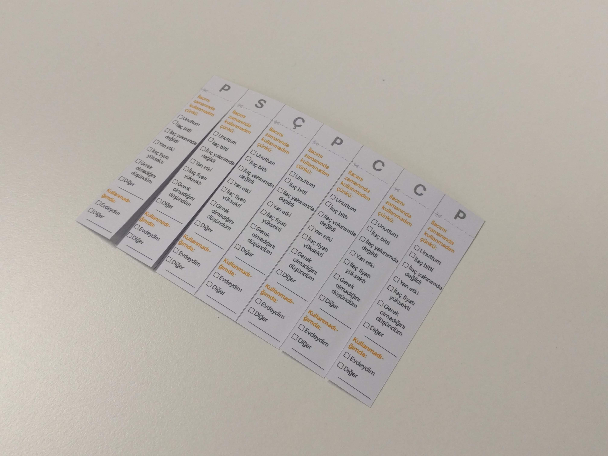
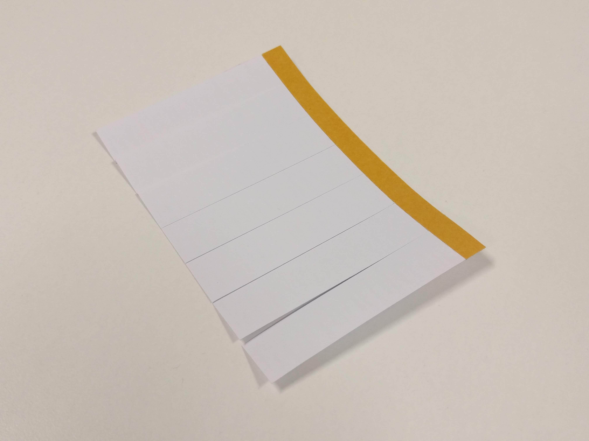
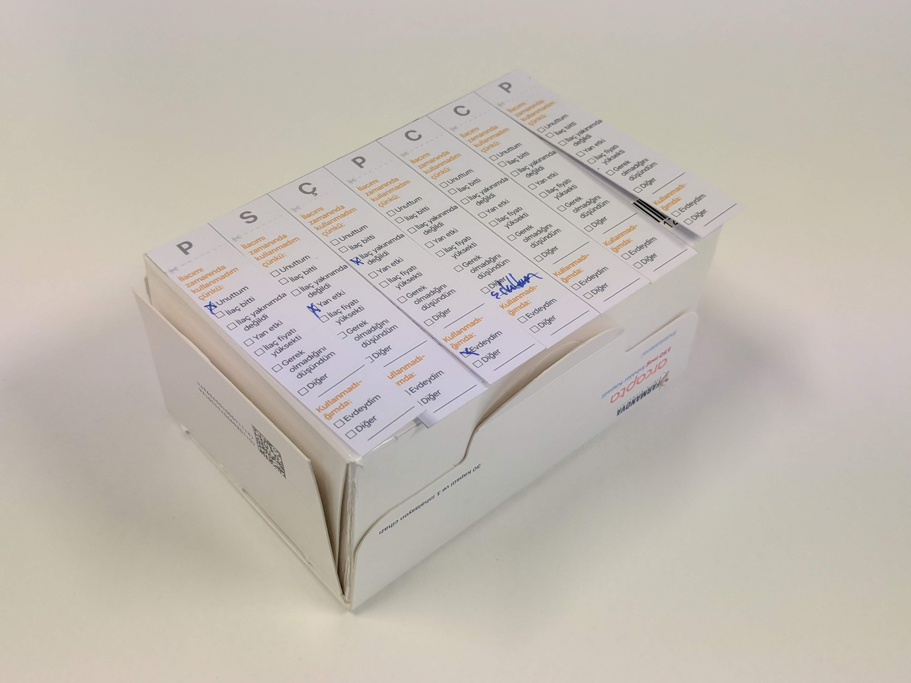
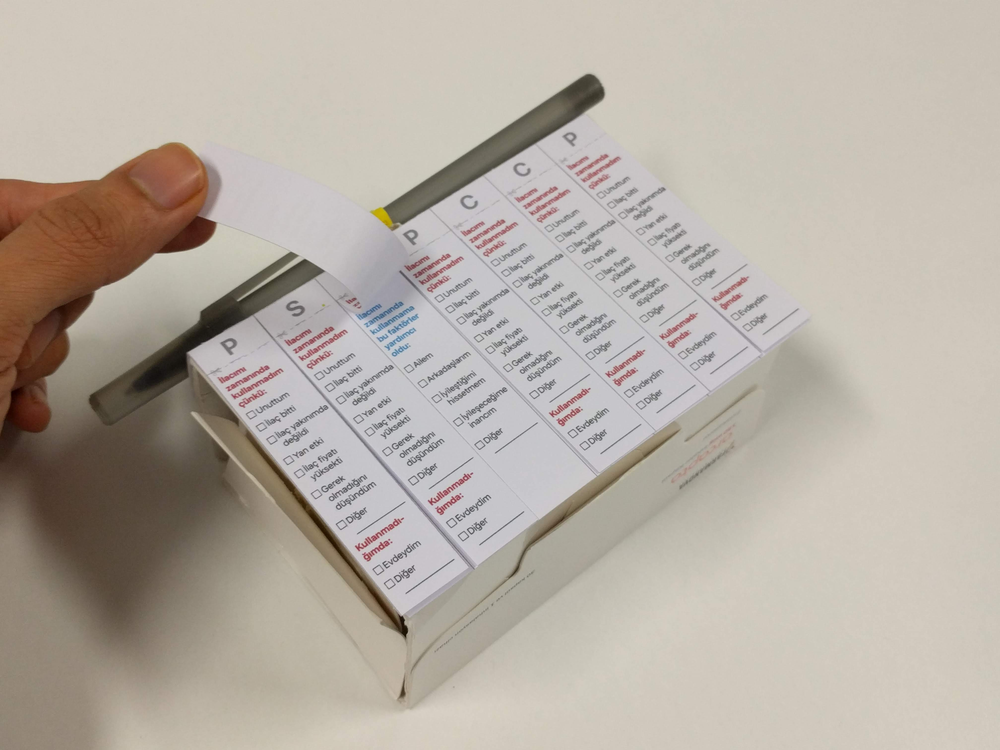

# Aim

“Drugs don't work in patients that don't take them” *(former US Surgeon General C. Everett Koop).* 

50% of people who suffer from chronic diseases do not adhere to their medication treatments.  Non-adherence to medication is associated with almost 200 000 deaths and an excess cost of €80–125 billion.

This study aims to explore the non-adherence problem by looking into patients' experiences. 

## 1- Pre-Diary Interview

Merhaba,

Çalışmaya katılmayı kabul ettiğiniz için teşekkürler.

Çalışmanın amacı sizin düzenli ilaç kullanım sürecinizdeki deneyiminizin incelenmesidir.

Öncelikle size birkaç soru sormak istiyorum:

|Soru| Araştırma amacı|
|--|--|
|1- Hastalığınız nedir ve ne kadar süre önce teşhis kondu?|Kullanıcının ne kadar süredir ilaç kullandığını öğrenerek ilaç kullanma alışkanlığını süreye bağlı olarak değerlendirmek. Kategoriler: 0-1 ay, 1-3 ay, 3-12 ay, 12 aydan fazla.|
|2- Düzenli ve hatasız ilaç kullanmanızı hatırlatıcı veya destekleyici yöntemler kullanıyor musunuz? Kullanıyorsanız bahsedebilir misiniz? Bu yöntemin neden size faydası olduğunu düşünüyorsunuz? Kullandığınız dijital ya da fiziksel bir yardımcı var ise fotoğrafını paylaşabilir misiniz?|Kullanıcıların düzenli ve hatasız ilaç kullanmasını motive eden ya da destekleyen, kendi geliştirdikleri ya da hazır kullandığı yöntemleri ve bu yöntemlerin neden faydalı olduğunu öğrenmek.
|3- İlacınızı düzenli olarak kullanmadığınız ya da atladığınız oldu mu? Oldu ise sebepleri neydi? |  Kullanıcının ilaç kullanmadığı durumlarının sebeplerini öğrenmek|

Çalışma kapsamında size bir adet kart vereceğim ve ilaç kutunuzun üzerine yapıştırmanızı isteyeceğim. 1 hafta boyunca her gün bu kartın gerekli kısımlarını doldurmanız gerekmektedir. Çalışma sonrasında sizinle kısa bir görüşme daha yapacağız ve ardından çalışma tamamlanmış olacak.

## 2- Post-Diary Interview

|Soru| Araştırma amacı|
|--|--|
|1- (Eğer hiçbir doz atlanmamış ise) İlacınızı düzenli bir şekilde almanızı motive eden neler vardı?| Kullanıcının doğru ilaç kullanma motivasyonunu öğrenmek.|
|2- (Eğer atlanan dozlar var ise sebepleri gözetilerek) Şu gün şu sebep ile ilacınızı kullanmamışsınız. Detaylı bir şekilde neden ilacınızı kullanmadığınızı anlatır mısınız? Sizce ne olsaydı ilacınızı zamanında kullanırdınız? |Kullanıcının ilaç kullanmadığı durumların sebeplerini detaylı bir şekilde öğrenerek motivasyonunun nasıl sağlanabileceği konusunda önerilerini öğrenmek.|
|3-Varsa, kullandığınız yöntemlerin ne kadar etkili olduğunu düşünüyorsunuz? |Kullanıcıların düzenli ve hatasız ilaç kullanmasını motive eden ya da destekleyen yöntemlerin neden faydalı olduğunu öğrenmek. |

